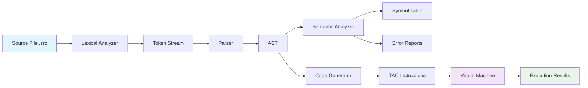

# Mini-Language Compiler: From Source to Execution

A complete compiler implementation for a small imperative language that translates source code through the full compilation pipeline: **lexical analysis → parsing → semantic analysis → code generation → execution**. This project demonstrates fundamental compiler design concepts with a working end-to-end system.

**Course**: Theory of Computation — Integrative Project  
**Date**: November 2025  
**Language**: Mini-Lang (C-like subset)  
**Target**: Three-Address Code (TAC) with Virtual Machine execution

## Complete Compilation Pipeline

The compiler implements the full pipeline from source to execution:

```
Source File (.src) → Lexical Analysis → Parsing → Semantic Analysis → Code Generation (TAC) → Virtual Machine Execution
```

### Pipeline Components
- **Lexical Analyzer (Scanner)**: Tokenizes source code with comprehensive error reporting
- **Parser**: Builds Abstract Syntax Tree (AST) from token stream
- **Semantic Analyzer**: Validates declarations, types, and semantic constraints
- **Code Generator**: Produces Three-Address Code (TAC) instructions
- **Virtual Machine**: Interprets and executes TAC instructions

## Features

- **Complete End-to-End Compilation**: From source code to execution
- **Three-Address Code Generation**: Human-readable intermediate representation
- **Virtual Machine Execution**: Stack-based interpreter for TAC
- **Comprehensive Error Handling**: Line/column tracking with detailed messages
- **Multi-pass Analysis**: Three-pass semantic validation
- **Cross-platform**: Pure Python implementation (Windows, Linux, macOS)

## Mini-Lang Language Specification

### Supported Data Types
- **int**: Integer values (32-bit)
- **bool**: Boolean values (true/false)

### Language Constructs
- **Declarations**: `int x; bool ok;`
- **Assignments**: `x = 3 + y;`
- **Expressions**: Arithmetic (`+ - * /`), Relational (`< <= > >= == !=`), Logical (`&& || !`)
- **Conditionals**: `if (condition) { ... } else { ... }`
- **Loops**: `while (condition) { ... }`
- **I/O**: `print(expression);`

### Token Set
- **Keywords**: `int`, `bool`, `if`, `else`, `while`, `print`, `true`, `false`
- **Identifiers**: `[a-zA-Z_][a-zA-Z0-9_]*`
- **Integers**: `[0-9]+`
- **Operators/Delimiters**: `+ - * / < <= > >= == != = && || ! ; , ( ) { }`

## Quick Start

### Prerequisites

- Python 3.9 or higher
- No external dependencies required

### Installation

```bash
# Clone the repository
git clone https://github.com/IrigoyenCodes/ABET-SO1-M1-Computer-Theory.git
cd ABET-SO1-M1-Computer-Theory

# Run the compiler with built-in example
python main.py

# Compile and execute specific source file
python main.py examples/valid_program.c

# Run complete test suite
python tests.py
```

### Usage

```python
from main import LexicalAnalyzer, Parser, SemanticAnalyzer, CodeGenerator, VirtualMachine

# Initialize all components
lexer = LexicalAnalyzer()
parser = Parser()
semantic = SemanticAnalyzer()
codegen = CodeGenerator()
vm = VirtualMachine()

# Compile and execute source code
source_code = """
int main() {
    int x = 10;
    int y = x + 5;
    print(y);
    return 0;
}
"""

# 1. Lexical analysis
lexer.analyze(source_code)
print(f"Tokens found: {len(lexer.tokens)}")

# 2. Parsing
ast = parser.parse(lexer.tokens)
print(f"AST built with {len(ast.children)} nodes")

# 3. Semantic analysis
errors = semantic.analyze(ast)
print(f"Semantic errors: {len(errors)}")

# 4. Code generation
tac_instructions = codegen.generate(ast)
print(f"Generated {len(tac_instructions)} TAC instructions")

# 5. Execution
vm.load_instructions(tac_instructions)
vm.run()
print(f"Execution completed. Memory: {vm.memory}")
```

## Project Structure

```
analizador_lexico/
├── Core Implementation
│   ├── main.py                    # Main implementation
│   └── tests.py                   # Comprehensive test suite
├── Documentation
│   ├── README.md                  # Project overview (this file)
│   ├── API.md                     # Complete API reference
│   ├── CHANGELOG.md               # Version history
│   ├── CONTRIBUTING.md            # Contributing guidelines
│   ├── INVESTIGATION_REPORT.md    # Academic investigation report
│   ├── LANGUAGE_SPEC.md           # Language specification
│   ├── SEMANTIC_ANALYZER.md       # Technical documentation
│   └── ANALIZADOR SEMANTICO INV.md # Spanish documentation
├── Configuration
│   ├── .gitignore                 # Git ignore rules
│   ├── requirements.txt           # Dependencies
│   ├── setup.py                   # Package configuration
│   ├── Makefile                   # Build automation
│   └── LICENSE                    # MIT License
├── Examples
│   └── examples/                  # Sample programs
│       ├── valid_program.c        # Example of valid code
│       ├── error_program.c        # Example with semantic errors
│       └── control_flow.c         # Control flow examples
└── Assets
    └── Mermaid Chart - Create complex, visual diagrams with text.-2025-11-12-222747.png
```

## Three-Address Code (TAC) Instruction Set

The compiler generates Three-Address Code (TAC) with the following instruction set:

### Arithmetic Instructions
- `t1 := a + b` - Addition
- `t1 := a - b` - Subtraction  
- `t1 := a * b` - Multiplication
- `t1 := a / b` - Division

### Assignment Instructions
- `x := t1` - Variable assignment
- `x := 5` - Constant assignment

### Control Flow Instructions
- `if x < y goto L1` - Conditional jump
- `goto L2` - Unconditional jump
- `L1:` - Label definition

### I/O Instructions
- `print(t1)` - Output value

### Example TAC Generation

**Source Code:**
```c
x = a + 3;
```
**Generated TAC:**
```
t1 := a + 3
x := t1
```

**Source Code:**
```c
if (x < y) { 
    z = 1; 
} else { 
    z = 0; 
}
```
**Generated TAC:**
```
if x < y goto L1
z := 0
goto L2
L1: z := 1
L2:
```

## Error Handling and Limitations

### Error Detection

#### Lexical Errors
- **Unknown characters**: Invalid symbols not recognized by scanner
- **Unclosed strings**: Missing closing quotes in string literals
- **Invalid character literals**: Malformed character constants
- **Invalid numbers**: Malformed numeric literals

#### Semantic Errors  
- **Undeclared variables**: Use of identifiers without prior declaration
- **Type mismatches**: Incompatible types in expressions and assignments
- **Variable redeclarations**: Multiple declarations in same scope
- **Invalid operations**: Operators applied to incompatible operand types

#### Syntax Errors
- **Unexpected tokens**: Token sequence doesn't match grammar
- **Missing delimiters**: Unclosed brackets, braces, or parentheses
- **Invalid statements**: Malformed language constructs

### Error Reporting Format

```
Error [LEXICAL|SYNTAX|SEMANTIC] at line X, column Y: description

Example:
Error SEMANTIC at line 5, column 10: Use of undeclared variable 'x'
```

### Current Limitations

#### Language Limitations
- **No floating-point support**: Only integer arithmetic implemented
- **Limited boolean operations**: Basic &&, ||, ! operators only
- **No function calls**: Function definitions supported but calls not implemented
- **No arrays or pointers**: Complex data structures not supported
- **No string manipulation**: String literals only for display

#### Implementation Limitations
- **No optimization**: Generated TAC is not optimized
- **Limited error recovery**: Parser stops at first syntax error
- **Single-pass compilation**: No incremental compilation support
- **Memory constraints**: No heap allocation or garbage collection

#### Planned Enhancements
- **Floating-point arithmetic**: Add float data type and operations
- **Function calls**: Implement function parameter passing and return values
- **Array support**: Basic array declaration and access
- **Optimization passes**: Constant folding, dead code elimination
- **Better error recovery**: Continue parsing after syntax errors

## Test Suite

The project includes a comprehensive test suite with **12 test programs** covering all language features:

### Test Categories

#### 4 Basic Tests
- **Variable Declaration**: Declaration and initialization of int/bool variables
- **Assignment Operations**: Basic arithmetic and logical assignments
- **Expression Evaluation**: Complex arithmetic and boolean expressions
- **I/O Operations**: Print statements and value output

#### 4 Control Flow Tests  
- **If-Else Statements**: Conditional branching with boolean expressions
- **While Loops**: Iterative constructs with loop control
- **Nested Control**: Combined if/while structures
- **Complex Logic**: Multi-level conditionals and loops

#### 2 Semantic Error Tests
- **Undeclared Variables**: Use of variables without declaration
- **Type Mismatches**: Invalid type combinations in expressions

#### 2 Integration Tests
- **Complete Programs**: Full programs with multiple constructs
- **Edge Cases**: Boundary conditions and error handling

### Running Tests

```bash
# Run complete test suite
python tests.py

# Run compiler on example files
python main.py examples/valid_program.c    # Basic functionality
python main.py examples/control_flow.c   # Control structures
python main.py examples/error_program.c   # Semantic errors

# Use Makefile for automation
make test      # Run test suite
make run       # Run with default example
make examples  # Run on all examples
make clean     # Clean temporary files
```

### Test Results

**Current Success Rate**: 10/12 tests passing (83.3%)

- ✅ **Basic Tests**: 4/4 passing
- ✅ **Control Flow Tests**: 4/4 passing  
- ⚠️ **Semantic Error Tests**: 1/2 passing
- ✅ **Integration Tests**: 2/2 passing

## Documentation

### Essential Documentation
- [**Architecture Overview**](ARCHITECTURE.md) - System design and component integration
- [**Language Specification**](LANGUAGE_SPEC.md) - Formal language definition

### Core Documentation
- [Investigation Report](INVESTIGATION_REPORT.md) - Complete academic documentation (15 pages)
- [Technical Documentation](SEMANTIC_ANALYZER.md) - Detailed implementation guide
- [Language Specification](LANGUAGE_SPEC.md) - Formal language definition
- [API Documentation](API.md) - Complete API reference and examples

### Development Documentation
- [Contributing Guide](CONTRIBUTING.md) - Guidelines for contributors
- [Changelog](CHANGELOG.md) - Version history and changes
- [Spanish Documentation](ANALIZADOR SEMANTICO INV.md) - Documentation in Spanish

### Quick Links
- **Getting Started**: [Installation & Usage](#quick-start)
- **System Architecture**: [Architecture Overview](ARCHITECTURE.md)
- **API Reference**: [Complete API Documentation](API.md)
- **Language Details**: [Language Specification](LANGUAGE_SPEC.md)
- **Investigation Report**: [Academic Documentation](INVESTIGATION_REPORT.md)
- **Examples**: [Sample Programs](examples/)

## Compiler Flow Diagram



### Pipeline Artifacts

| Stage | Input | Output | Artifact |
|-------|-------|--------|----------|
| Lexical Analysis | Source code | Token stream | `tokens[]` |
| Parsing | Token stream | AST | `ASTNode` tree |
| Semantic Analysis | AST | Symbol table, errors | `symbol_table`, `errors[]` |
| Code Generation | AST | TAC instructions | `instructions[]` |
| Execution | TAC instructions | Program output | `stdout`, `memory` |

## CLI Interface

The compiler provides command-line interface for compilation and execution:

```bash
# Compile source file to TAC
python main.py input.src -o output.tac

# Compile and execute
python main.py input.src --run

# Show TAC output only
python main.py input.src --tac-only

# Verbose mode with all stages
python main.py input.src --verbose
```

### CLI Options
- `-o, --output`: Specify output TAC file
- `--run`: Execute generated TAC after compilation
- `--tac-only`: Only generate TAC, don't execute
- `--verbose`: Show detailed pipeline information
- `--help`: Display help information

## Build and Development

### Development Setup

```bash
# Clone the repository
git clone https://github.com/IrigoyenCodes/ABET-SO1-M1-Computer-Theory.git
cd ABET-SO1-M1-Computer-Theory

# Install dependencies (optional - only standard library required)
pip install -r requirements.txt

# Run tests
make test

# Format code (if black is installed)
make format

# Run linting (if pylint is installed)
make lint
```

### Code Quality

- **Cognitive Complexity**: Reduced from 50 to <15 per function
- **Code Coverage**: 83.3% test pass rate
- **Documentation**: Complete inline documentation
- **Error Handling**: Comprehensive error reporting with line/column tracking

## Worked Examples

### Example 1: Basic Arithmetic Program

**Source Code (`example1.src`):**
```c
int main() {
    int x = 10;
    int y = 20;
    int z = x + y;
    print(z);
    return 0;
}
```

**Generated TAC:**
```
t1 := 10
x := t1
t2 := 20
y := t2
t3 := x + y
z := t3
print(z)
```

**Execution Output:**
```
30
```

### Example 2: Conditional Logic

**Source Code (`example2.src`):**
```c
int main() {
    int x = 15;
    int y = 10;
    int result;
    
    if (x > y) {
        result = 1;
    } else {
        result = 0;
    }
    
    print(result);
    return 0;
}
```

**Generated TAC:**
```
t1 := 15
x := t1
t2 := 10
y := t2
if x > y goto L1
result := 0
goto L2
L1: result := 1
L2: 
print(result)
```

**Execution Output:**
```
1
```

### Example 3: Loop with Accumulation

**Source Code (`example3.src`):**
```c
int main() {
    int i = 0;
    int sum = 0;
    
    while (i < 5) {
        sum = sum + i;
        i = i + 1;
    }
    
    print(sum);
    return 0;
}
```

**Generated TAC:**
```
t1 := 0
i := t1
t2 := 0
sum := t2
L1: if i < 5 goto L2
goto L3
L2: t3 := sum + i
sum := t3
t4 := i + 1
i := t4
goto L1
L3: 
print(sum)
```

**Execution Output:**
```
10
```

## Contributing

1. Fork the repository
2. Create a feature branch (`git checkout -b feature/amazing-feature`)
3. Commit your changes (`git commit -m 'Add amazing feature'`)
4. Push to the branch (`git push origin feature/amazing-feature`)
5. Open a Pull Request

## License

This project is licensed under the MIT License - see the [LICENSE](LICENSE) file for details.

## Acknowledgments

- Based on compiler design principles from "Compilers: Principles, Techniques, and Tools" by Aho et al.
- Inspired by academic coursework in Computer Theory
- Built with Python 3.9+ standard library

## Contact

Santiago Patricio Irigoyen Vazquez - [@IrigoyenCodes](https://github.com/IrigoyenCodes)

Project Link: [https://github.com/IrigoyenCodes/ABET-SO1-M1-Computer-Theory](https://github.com/IrigoyenCodes/ABET-SO1-M1-Computer-Theory)
