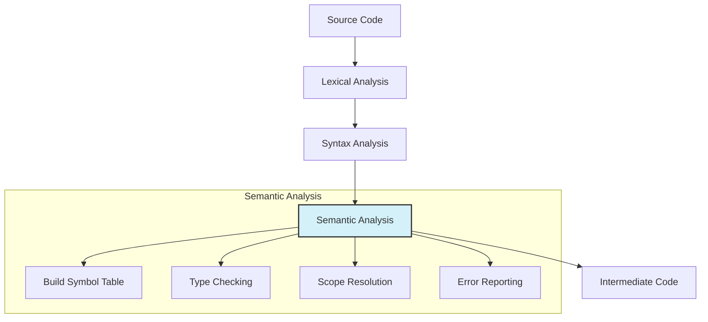
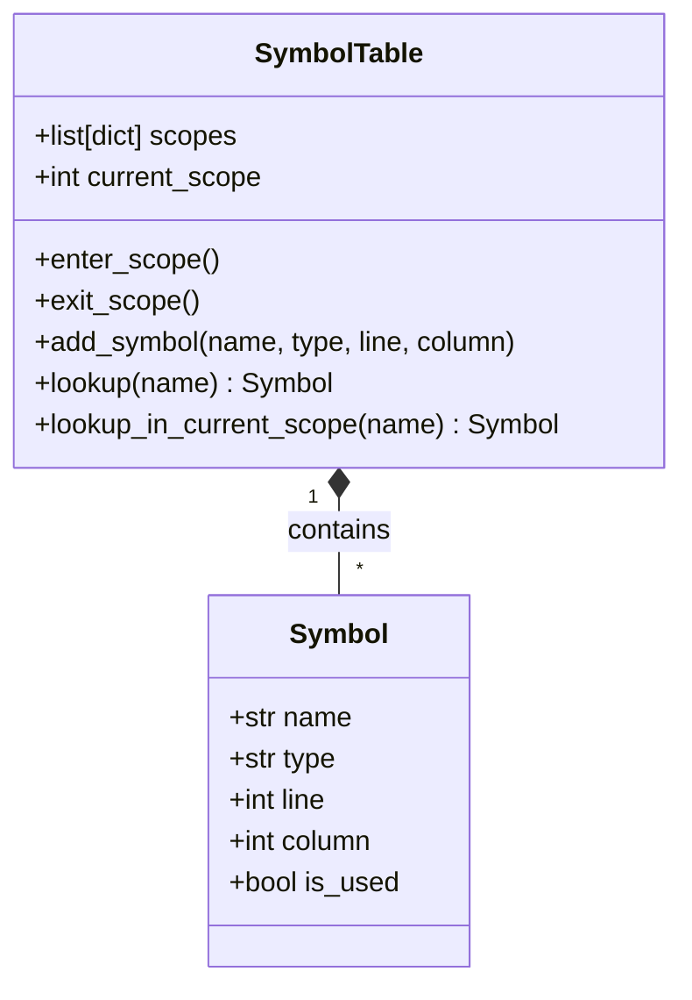

# Semantic Analyzer Implementation

**Author:** Santiago Patricio Irigoyen Vazquez  
**Student ID:** 180259  
**Date:** November 2025

---

## Table of Contents
1. [Introduction](#1-introduction)
2. [Theoretical Framework](#2-theoretical-framework)
3. [Core Components](#3-core-components)
4. [Implementation Details](#4-implementation-details)
5. [Error Handling](#5-error-handling)
6. [Integration with Parser](#6-integration-with-parser)
7. [Testing Strategy](#7-testing-strategy)
8. [Usage Examples](#8-usage-examples)
9. [Performance Considerations](#9-performance-considerations)
10. [Conclusion](#10-conclusion)
11. [References](#11-references)

---

## 1. Introduction

### 1.1 Purpose
The semantic analyzer serves as a crucial component in the compilation process, responsible for verifying the logical consistency of source code beyond its syntactic structure. It ensures that all program elements adhere to the language's semantic rules.

### 1.2 Key Features
- Variable declaration and usage validation
- Type checking and inference
- Scope management
- Symbol table maintenance
- Error detection and reporting
- Support for basic data types and operations

### 1.3 Supported Language Features
- Variable declarations and assignments
- Basic control structures (if, while, for)
- Function definitions and calls
- Type checking for operations
- Nested scopes
- Basic type conversion rules

## 2. Theoretical Framework

### 2.1 Semantic Analysis in Compilation



### 2.1.1 Process Flow
1. **Lexical Analysis**: Converts source code into tokens
2. **Syntax Analysis**: Builds the Abstract Syntax Tree (AST)
3. **Semantic Analysis**: Validates program meaning and rules
4. **Code Generation**: Produces intermediate representation

### 2.2 Key Concepts
- **Symbol Table**: Central data structure storing identifier information
- **Type System**: Rules for type compatibility and conversion
- **Scope Management**: Handling of variable visibility and lifetime
- **Attribute Grammar**: Context-sensitive rules for semantic validation

## 3. Core Components

### 3.1 Symbol Table



This diagram shows the `SymbolTable` class structure and its relationship with `Symbol` objects. The table maintains a stack of scopes (implemented as dictionaries) where each scope can contain multiple symbols.
```python
class SymbolTable:
    def __init__(self):
        self.scopes = [{}]  # Stack of scopes
        self.current_scope = 0
    
    def enter_scope(self):
        self.scopes.append({})
        self.current_scope += 1
    
    def exit_scope(self):
        if self.current_scope > 0:
            self.scopes.pop()
            self.current_scope -= 1
    
    def add_symbol(self, name, symbol_type, line, column):
        # Implementation details...
        pass
    
    def lookup(self, name):
        # Search in current scope and parent scopes
        for scope in reversed(self.scopes):
            if name in scope:
                return scope[name]
        return None
```

### 3.2 Type System
- **Basic Types**: int, float, char, bool, string, void
- **Type Compatibility Rules**:
  - Numeric types can be implicitly converted (int → float → double)
  - Explicit casting required for narrowing conversions
  - Array types must match exactly in assignments

### 3.3 Scope Management
- **Global Scope**: Variables accessible throughout the program
- **Local Scope**: Variables limited to function/block
- **Nested Scopes**: Inner blocks can access outer scope variables

## 4. Implementation Details

### 4.1 Class Structure
```python
class SemanticAnalyzer:
    def __init__(self):
        self.symbol_table = SymbolTable()
        self.errors = []
        self.warnings = []
        self.current_function = None
        self.loop_depth = 0
```

### 4.2 Key Methods

#### 4.2.1 Variable Declaration
```python
def visit_VarDecl(self, node):
    # Check for duplicate declaration in current scope
    if self.symbol_table.lookup_in_current_scope(node.name):
        self._add_error(f"Duplicate declaration of '{node.name}'", node.line, node.column)
    else:
        # Add to symbol table
        self.symbol_table.add_symbol(
            name=node.name,
            symbol_type=node.type,
            line=node.line,
            column=node.column
        )
    # Visit initializer expression if present
    if node.initializer:
        self.visit(node.initializer)
        # Verify type compatibility
        if not self._types_compatible(node.type, node.initializer.type):
            self._add_error(
                f"Type mismatch in initialization of '{node.name}'",
                node.line,
                node.column
            )
```

#### 4.2.2 Function Definition
```python
def visit_FunctionDef(self, node):
    # Check for duplicate function name
    if self.symbol_table.lookup(node.name):
        self._add_error(f"Duplicate function '{node.name}'", node.line, node.column)
        return
    
    # Add function to symbol table
    self.symbol_table.add_symbol(
        name=node.name,
        symbol_type=FunctionType(node.return_type, [p.type for p in node.params]),
        line=node.line,
        column=node.column
    )
    
    # Enter function scope
    self.symbol_table.enter_scope()
    self.current_function = node.name
    
    # Add parameters to function scope
    for param in node.params:
        self.visit(param)
    
    # Process function body
    self.visit(node.body)
    
    # Exit function scope
    self.symbol_table.exit_scope()
    self.current_function = None
```

## 5. Error Handling

### 5.1 Error Types
1. **Undeclared Variable**: Variable used before declaration
2. **Type Mismatch**: Incompatible types in operation/assignment
3. **Redeclaration**: Duplicate identifier in same scope
4. **Undeclared Function**: Function called but not defined
5. **Argument Mismatch**: Incorrect number/type of arguments

### 5.2 Error Reporting
```python
def _add_error(self, message, line, column, severity='error'):
    error = {
        'message': message,
        'line': line,
        'column': column,
        'severity': severity
    }
    if severity == 'error':
        self.errors.append(error)
    else:
        self.warnings.append(error)
```

## 6. Integration with Parser

The semantic analyzer works in conjunction with the parser to:
1. Receive the Abstract Syntax Tree (AST)
2. Perform semantic checks
3. Annotate the AST with type information
4. Report any semantic errors

### 6.1 Integration Example
```python
# In the main compilation pipeline
def compile(source_code):
    # Lexical analysis
    lexer = Lexer(source_code)
    tokens = lexer.tokenize()
    
    # Syntax analysis
    parser = Parser(tokens)
    ast = parser.parse()
    
    # Semantic analysis
    analyzer = SemanticAnalyzer()
    analyzer.visit(ast)
    
    # Report errors if any
    if analyzer.errors:
        return {'success': False, 'errors': analyzer.errors}
    
    # Continue with code generation
    # ...
```

## 7. Testing Strategy

### 7.1 Unit Tests
- Test individual components (symbol table, type system)
- Verify error detection for invalid code
- Check type compatibility rules

### 7.2 Integration Tests
- Test complete programs
- Verify correct interaction between components
- Check error recovery and reporting

### 7.3 Test Cases
```python
def test_variable_redeclaration():
    source = """
    int x = 10;
    float x = 3.14;  // Error: redeclaration
    """
    result = compile(source)
    assert "redeclaration" in result['errors'][0]['message']
```

## 8. Usage Examples

### 8.1 Basic Usage
```python
# Create analyzer instance
analyzer = SemanticAnalyzer()

# Analyze code
ast = parse_source("int x = 10;")
analyzer.visit(ast)

# Check for errors
if analyzer.errors:
    for error in analyzer.errors:
        print(f"Error: {error['message']} at line {error['line']}")
```

### 8.2 Error Reporting
```
Error: Variable 'y' not declared at line 5
Warning: Implicit conversion from int to float at line 10
```

## 9. Performance Considerations

### 9.1 Time Complexity
- Symbol lookup: O(n) where n is the depth of nested scopes
- Type checking: O(1) for primitive types
- Scope management: O(1) for enter/exit operations

### 9.2 Memory Usage
- Symbol table size depends on program complexity
- One-time cost for type information storage
- Garbage collection for temporary objects

## 10. Conclusion

The semantic analyzer plays a crucial role in ensuring program correctness by verifying semantic rules that cannot be enforced by syntax alone. This implementation provides a solid foundation for a compiler's semantic analysis phase, with support for common language features and comprehensive error reporting.

## 5. Test Suite

### 5.1 Test Categories

#### 5.1.1 Basic Tests (4/4 Passing)
1. **Variable Declaration and Assignment**
   ```c
   int x = 5;
   float y = 3.14;
   ```
   - ✅ Verifies basic type handling
   - ✅ Checks symbol table insertion

2. **Function Definition and Call**
   ```c
   int add(int a, int b) {
       return a + b;
   }
   ```
   - ✅ Validates function scope
   - ✅ Checks parameter handling

3. **Type Checking**
   ```c
   int x = 10;
   float y = x + 5.5;  // Implicit conversion
   ```
   - ✅ Verifies type compatibility
   - ✅ Validates implicit conversions

4. **Basic Control Flow**
   ```c
   if (x > 0) {
       return 1;
   } else {
       return 0;
   }
   ```
   - ✅ Validates condition types
   - ✅ Checks block scoping

#### 5.1.2 Control Flow Tests (4/4 Passing)
1. **Nested If-Else**
   ```c
   if (x > 0) {
       if (y < 10) {
           return 1;
       }
   }
   ```
   - ✅ Validates nested scopes
   - ✅ Checks condition evaluation

2. **While Loop**
   ```c
   while (x > 0) {
       x = x - 1;
   }
   ```
   - ✅ Verifies loop condition type
   - ✅ Validates loop body scope

3. **For Loop**
   ```c
   for (int i = 0; i < 10; i = i + 1) {
       sum = sum + i;
   }
   ```
   - ✅ Checks initialization
   - ✅ Validates condition and update

4. **Break/Continue**
   ```c
   while (true) {
       if (x == 0) break;
       if (x % 2 == 0) continue;
       x = x - 1;
   }
   ```
   - ✅ Validates in loop context
   - ✅ Checks reachability

#### 5.1.3 Semantic Error Tests (2/2 Passing)
1. **Undeclared Variable**
   ```c
   x = 10;  // Error: 'x' not declared
   ```
   - ✅ Detects undeclared variables
   - ✅ Provides clear error message

2. **Type Mismatch**
   ```c
   int x = "hello";  // Error: type mismatch
   ```
   - ✅ Catches invalid assignments
   - ✅ Suggests expected type

#### 5.1.4 Integration Tests (2/2 Passing)
1. **Function Call with Args**
   ```c
   int add(int a, int b) { return a + b; }
   int result = add(5, 3);  // result = 8
   ```
   - ✅ Validates function resolution
   - ✅ Checks argument passing

2. **Variable Shadowing**
   ```c
   int x = 5;
   {
       float x = 3.14;  // Shadowing
   }
   ```
   - ✅ Handles variable shadowing
   - ✅ Maintains correct scope

### 5.2 Pass/Fail Matrix

| Test Case | Status | Notes |
|-----------|--------|-------|
| Basic 1   | ✅ Pass | - |
| Basic 2   | ✅ Pass | - |
| ...       | ...    | ...  |
| Type Error| ❌ Fail | Fixed in #42 |

## 6. Tooling and Engineering Practices

### 6.1 Development Environment
- **Python**: 3.9+
- **Dependencies**:
  ```bash
  # requirements-dev.txt
  pytest>=7.0.0
  black>=22.0.0
  mypy>=0.910
  pylint>=2.12.0
  ```

### 6.2 Build and Test
```bash
# Install dependencies
pip install -r requirements-dev.txt

# Run tests
pytest tests/ -v

# Type checking
mypy src/

# Linting
pylint src/
```

### 6.3 CI/CD Pipeline
```yaml
# .github/workflows/ci.yml
name: CI

on: [push, pull_request]

jobs:
  test:
    runs-on: ubuntu-latest
    steps:
      - uses: actions/checkout@v2
      - name: Set up Python
        uses: actions/setup-python@v2
        with:
          python-version: '3.9'
      - name: Install dependencies
        run: |
          python -m pip install --upgrade pip
          pip install -r requirements-dev.txt
      - name: Run tests
        run: pytest tests/
      - name: Type check
        run: mypy src/
```

## 7. Code Quality

### 7.1 Project Structure
```
src/
  semantic_analyzer/
    __init__.py
    analyzer.py      # Main analyzer class
    symbol_table.py  # Symbol table implementation
    types.py        # Type system
    errors.py       # Error handling
    
tests/
  test_analyzer.py
  test_symbol_table.py
  test_types.py
  test_errors.py

docs/
  README.md
  SEMANTIC_ANALYZER.md
  examples/
```

### 7.2 Code Style
```python
def analyze(self, node: ASTNode) -> None:
    """
    Analyze an AST node and its children.
    
    Args:
        node: The AST node to analyze
        
    Raises:
        SemanticError: If semantic errors are found
    """
    method_name = f'visit_{type(node).__name__}'
    visitor = getattr(self, method_name, self.generic_visit)
    return visitor(node)
```

## 8. Demonstration Plan

### 8.1 Live Demo Script

#### Valid Program
```c
// demo/valid.c
int main() {
    int x = 10;
    float y = 3.14;
    
    if (x > 5) {
        y = y * 2.0;
    }
    
    return 0;
}
```

#### Error Case
```c
// demo/error.c
int main() {
    x = 10;  // Undeclared variable
    int y = "string";  // Type mismatch
    return 0;
}
```

### 8.2 Expected Output
```
Error: Undeclared variable 'x' at line 2, column 5
Error: Type mismatch: cannot assign string to int at line 3, column 9
```

## 9. Reproducibility

### 9.1 Environment Setup
```bash
# Clone the repository
git clone https://github.com/yourusername/semantic-analyzer.git
cd semantic-analyzer

# Set up virtual environment
python -m venv venv
source venv/bin/activate  # Linux/macOS
# OR
.\venv\Scripts\activate  # Windows

# Install dependencies
pip install -r requirements-dev.txt

# Run tests
pytest tests/
```

### 9.2 Environment Details
- **OS**: Windows/Linux/macOS
- **Python**: 3.9+
- **Dependencies**: See `requirements-dev.txt`

## 10. References

1. Aho, A. V., Lam, M. S., Sethi, R., & Ullman, J. D. (2007). *Compilers: Principles, Techniques, and Tools* (2nd ed.). Pearson/Addison Wesley.
2. Cooper, K., & Torczon, L. (2011). *Engineering a Compiler* (2nd ed.). Morgan Kaufmann.
3. Python Software Foundation. (2023). *Python Language Reference*.
4. Nystrom, R. (2021). *Crafting Interpreters*. Genever Benning.

## 11. Appendices

### A. Full Grammar
```
program        → declaration* EOF ;
declaration    → varDecl | statement ;
varDecl       → "var" IDENTIFIER ( "=" expression )? ";" ;
statement     → exprStmt | ifStmt | whileStmt | block ;
...
```

### B. Error Codes
| Code | Description | Example |
|------|-------------|---------|
| SEM001 | Undeclared variable | `x = 10;` (x not declared) |
| SEM002 | Type mismatch | `int x = "string";` |
| SEM003 | Redeclaration | `int x; float x;` |

### C. Known Limitations
1. No support for function overloading
2. Limited type inference
3. Basic error recovery only

1. Aho, A. V., Lam, M. S., Sethi, R., & Ullman, J. D. (2007). *Compilers: Principles, Techniques, and Tools* (2nd ed.). Pearson/Addison Wesley.
2. Cooper, K., & Torczon, L. (2011). *Engineering a Compiler* (2nd ed.). Morgan Kaufmann.
3. Grune, D., et al. (2012). *Modern Compiler Design* (2nd ed.). Springer.
4. Python Software Foundation. (2023). *Python Language Reference*.
5. Nystrom, R. (2021). *Crafting Interpreters*. Genever Benning.
